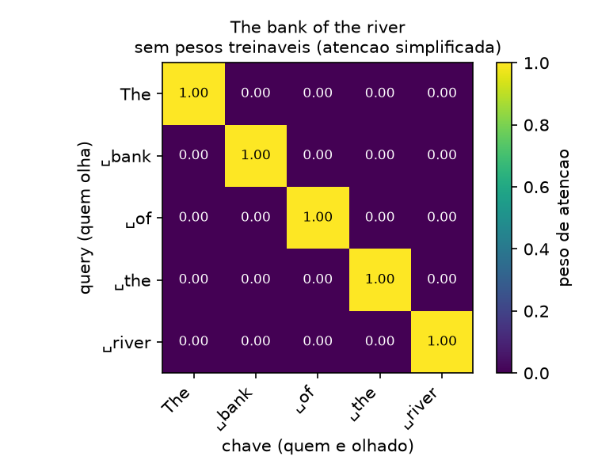
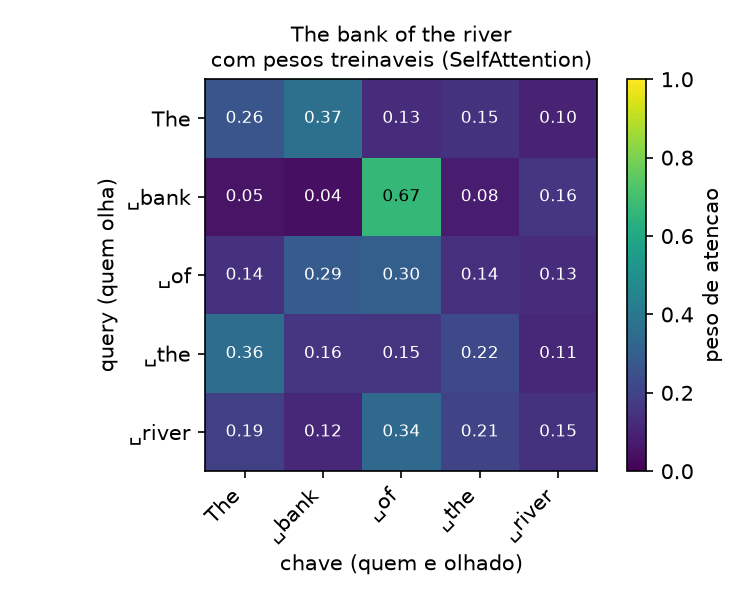
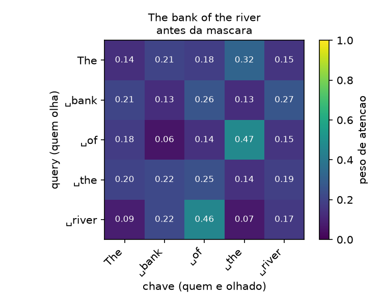
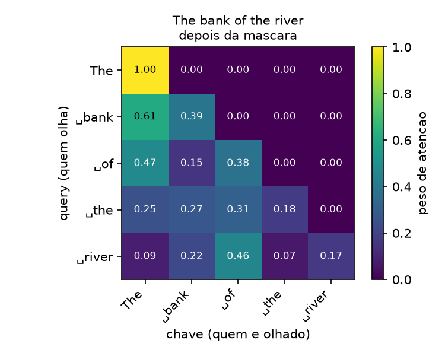
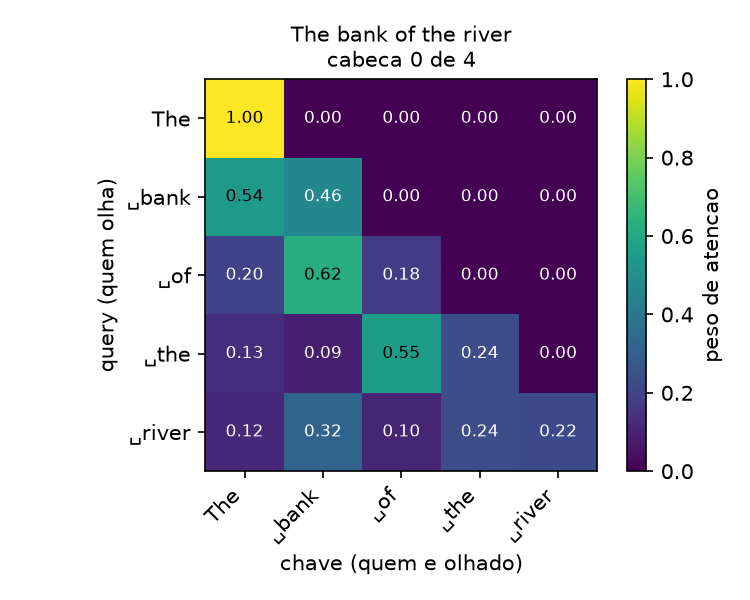
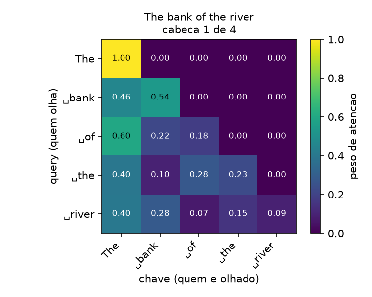
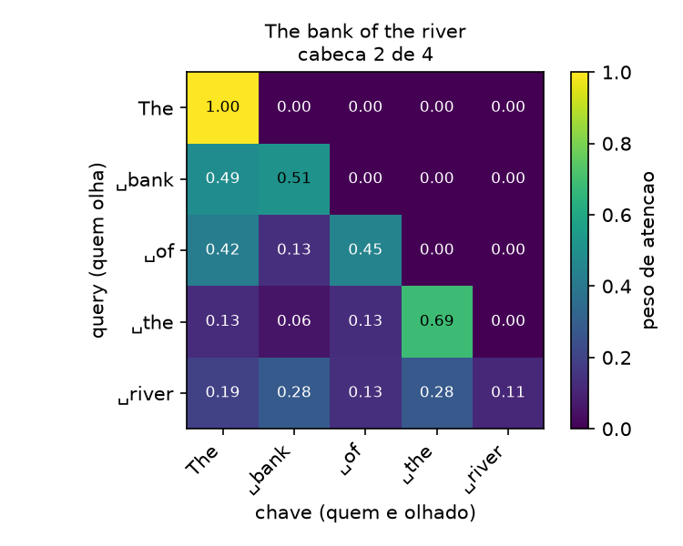
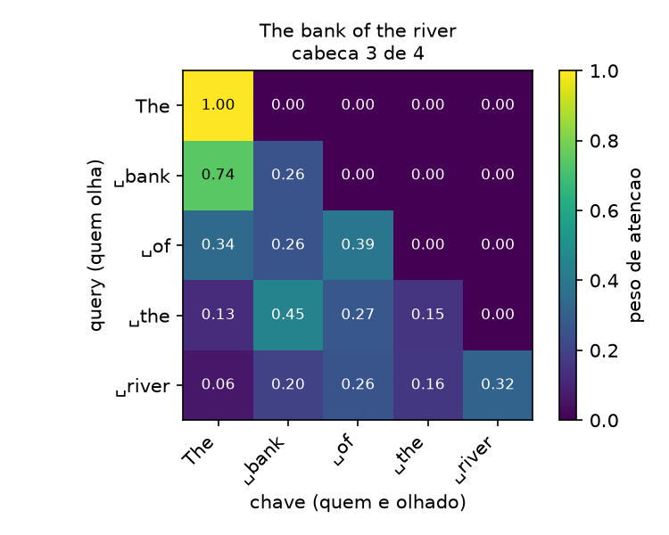

# Sprint 3 - Atencao: resultados dos experimentos

Gerado por `experimentos/sprint03/atencao_experimentos.py`. Nao editar a mao: rode o script novamente.

Todas as camadas em `eval()` e sob `torch.no_grad()`, com duas excecoes declaradas: o bloco do E1, que precisa do backward, e a tabela de dropout do E5, que so existe em `train()`. Seed fixa em 42 antes de cada tensor sorteado. Figuras em `resultados/figuras/`.

## E1 - Com e sem a divisao por raiz de d_k

**Pergunta:** a escala e cosmetica ou muda o regime em que o softmax opera? E o que acontece com o gradiente que volta por ele?

**Configuracao:** Q, K e V sorteados de uma normal padrao, shape (1, 32, d_k), d_k na varredura 16, 32, 64, 128, 256, 768, 4096. Normal e nao uniforme: o argumento do raiz de d_k pressupoe componentes de media zero e variancia 1; com uniforme em [0, 1) os scores sairiam todos positivos e o efeito ficaria mascarado. O ultimo d_k esta fora da faixa do projeto e entra so para o limite ficar visivel.

Duas colunas medem o gradiente, e elas nao dizem a mesma coisa. A **sensibilidade** e a soma de p(1-p) na linha, o fator pelo qual o softmax multiplica o gradiente que passa por ele: vale ~1 na linha uniforme e 0 na linha one-hot, e nao depende da escala da perda. A **norma do gradiente** e medida no caminho real da atencao (`(pesos @ values).pow(2).mean()`, derivada em relacao aos scores que entram no softmax). Nao e uma cross-entropy de proposito: o gradiente dela em relacao aos scores e `p - y`, que nao desaparece com o softmax saturado porque a conta cancela o jacobiano -- medir por ali daria a conclusao oposta a correta.

Entropia maxima possivel com 32 tokens: ln(32) = 3.466 nats (atencao uniforme). Zero seria olhar um token so.

| d_k  | escala | desvio dos scores | peso maximo medio | entropia media (nats) | sensibilidade Σp(1-p) | norma do grad. nos scores | norma do grad. nos pesos |
| ---- | ------ | ----------------- | ----------------- | --------------------- | --------------------- | ------------------------- | ------------------------ |
| 16   | sim    | 1.022             | 0.191             | 2.955                 | 0.9156                | 1.71e-02                  | 1.59e-01                 |
| 16   | nao    | 4.090             | 0.707             | 0.908                 | 0.4101                | 3.91e-02                  | 4.71e-01                 |
| 32   | sim    | 0.973             | 0.157             | 3.054                 | 0.9315                | 8.43e-03                  | 1.22e-01                 |
| 32   | nao    | 5.503             | 0.759             | 0.729                 | 0.3485                | 3.92e-02                  | 3.95e-01                 |
| 64   | sim    | 1.003             | 0.164             | 3.005                 | 0.9247                | 1.43e-02                  | 1.24e-01                 |
| 64   | nao    | 8.028             | 0.810             | 0.532                 | 0.2715                | 3.39e-02                  | 3.82e-01                 |
| 128  | sim    | 0.991             | 0.155             | 3.049                 | 0.9318                | 8.85e-03                  | 9.49e-02                 |
| 128  | nao    | 11.215            | 0.894             | 0.310                 | 0.1619                | 2.67e-02                  | 3.53e-01                 |
| 256  | sim    | 1.014             | 0.169             | 2.991                 | 0.9255                | 8.54e-03                  | 9.94e-02                 |
| 256  | nao    | 16.226            | 0.920             | 0.220                 | 0.1209                | 2.31e-02                  | 3.48e-01                 |
| 768  | sim    | 1.019             | 0.159             | 3.014                 | 0.9266                | 1.03e-02                  | 9.92e-02                 |
| 768  | nao    | 28.250            | 0.888             | 0.252                 | 0.1512                | 2.36e-02                  | 3.36e-01                 |
| 4096 | sim    | 1.006             | 0.160             | 3.025                 | 0.9300                | 7.46e-03                  | 9.28e-02                 |
| 4096 | nao    | 64.416            | 0.981             | 0.060                 | 0.0333                | 1.47e-02                  | 3.50e-01                 |

A sensibilidade cai uma ordem de grandeza sem a escala e fica parada com ela -- e a saturacao, medida. Ja a norma do gradiente nos scores NAO desaba junto, e o motivo esta na ultima coluna: quando a atencao se concentra num token so, o vetor de contexto vira uma linha de V inteira em vez de uma media de 32, a perda cresce e o gradiente que CHEGA ao softmax cresce com ela. Os dois efeitos se cancelam em parte. Ler so a norma levaria a concluir que a escala nao muda nada; a conclusao certa e que ela muda o regime, e o preco da saturacao aparece quando a rede fica profunda e esse fator se multiplica camada apos camada.

## E2 - Dimensao do embedding e tamanho da sequencia

**Pergunta:** aumentar `emb_dim` e aumentar `context_length` custam a mesma coisa? Onde cada um aparece -- em parametros, em memoria ou em tempo?

**Configuracao:** SelfAttention com d_in = d_out, lote de 1 sequencia. Tempo: 3 execucoes de aquecimento descartadas e mediana de 11 medidas, sob `torch.no_grad()` e em `eval()`. Maquina CPU-only (ver requirements.txt), entao os tempos absolutos valem pouco; o que interessa e a razao entre linhas.

### E2a - Dimensao, com T = 128 fixo

| d_in = d_out | parametros (3·d_in·d_out) | pesos em float32 | tempo (ms) |
| ------------ | ------------------------- | ---------------- | ---------- |
| 16           | 768                       | 0.00 MB          | 0.14       |
| 32           | 3 072                     | 0.01 MB          | 0.15       |
| 64           | 12 288                    | 0.05 MB          | 0.16       |
| 128          | 49 152                    | 0.19 MB          | 0.20       |
| 256          | 196 608                   | 0.75 MB          | 0.39       |
| 768          | 1 769 472                 | 6.75 MB          | 2.12       |

### E2b - Comprimento, com d_in = d_out = 256 fixo

| T    | parametros | celulas da matriz T×T | matriz T×T em float32 | tempo (ms) |
| ---- | ---------- | --------------------- | --------------------- | ---------- |
| 8    | 196 608    | 64                    | 0.00 MB               | 0.13       |
| 32   | 196 608    | 1 024                 | 0.00 MB               | 0.18       |
| 128  | 196 608    | 16 384                | 0.06 MB               | 0.38       |
| 256  | 196 608    | 65 536                | 0.25 MB               | 0.77       |
| 512  | 196 608    | 262 144               | 1.00 MB               | 1.76       |
| 1024 | 196 608    | 1 048 576             | 4.00 MB               | 7.42       |

A coluna de parametros do E2b e constante de proposito: a sequencia mais longa nao cria peso nenhum. O que ela cria e a matriz T×T, que e temporaria e quadratica -- e o custo que limita o `context_length`.

## E3 - Visualizacao: com e sem pesos treinaveis

**Pergunta:** sem pesos treinaveis, para onde cada token olha? E o que muda quando W_q, W_k e W_v entram?

**Configuracao:** frase `The bank of the river`, tokenizada pelo BPE em 5 tokens: `'The'`, `' bank'`, `' of'`, `' the'`, `' river'`. InputEmbedding com emb_dim 256 e os MESMOS vetores entrando nas duas versoes -- a unica diferenca e o que acontece depois deles.

| token      | sem pesos: olha mais | peso  | entropia | com pesos: olha mais | peso  | entropia |
| ---------- | -------------------- | ----- | -------- | -------------------- | ----- | -------- |
| `'The'`    | `'The'`              | 1.000 | 0.000    | `' bank'`            | 0.369 | 1.485    |
| `' bank'`  | `' bank'`            | 1.000 | 0.000    | `' of'`              | 0.667 | 1.049    |
| `' of'`    | `' of'`              | 1.000 | 0.000    | `' of'`              | 0.305 | 1.532    |
| `' the'`   | `' the'`             | 1.000 | 0.000    | `'The'`              | 0.357 | 1.525    |
| `' river'` | `' river'`           | 1.000 | 0.000    | `' of'`              | 0.340 | 1.540    |

Tokens que olham mais para si mesmos: 5 de 5 sem pesos treinaveis, 1 de 5 com. Sem W_q e W_k o criterio e o produto escalar cru dos embeddings, e o vetor mais parecido com um token tende a ser ele mesmo.

A diagonal da primeira figura nao e so parecida com o E1 -- e o mesmo fenomeno. A atencao simplificada roda com `scale=False` sobre vetores de 256 dimensoes, entao o produto de um embedding por ele mesmo e da ordem de centenas enquanto o dos outros fica perto de zero: e a linha `d_k = 256, escala = nao` do E1, levada ao extremo. O peso 1,000 com entropia 0,000 e softmax saturado, nao afinidade semantica. Com embeddings ainda nao treinados nao havia semantica alguma a encontrar.

## E4 - Duas sequencias com o mesmo comeco

**Pergunta:** o vetor de contexto de um token depende do que vem DEPOIS dele?

**Configuracao:** `The bank of the river` e `The bank of the city`, as duas pelas MESMAS instancias de InputEmbedding e de atencao. Pelo BPE as duas dao 5 tokens, iguais nas 4 primeiras posicoes e diferentes so na ultima (`' river'` contra `' city'`). Distancia L2 entre os vetores correspondentes.

| posicao | token     | distancia na entrada | distancia no contexto |
| ------- | --------- | -------------------- | --------------------- |
| 0       | `'The'`   | 0.000000             | 1.271455              |
| 1       | `' bank'` | 0.000000             | 1.905462              |
| 2       | `' of'`   | 0.000000             | 1.416324              |
| 3       | `' the'`  | 0.000000             | 1.279192              |

A coluna da entrada e zero exato: o mesmo Token ID na mesma posicao le as mesmas duas linhas das tabelas de embedding. Toda diferenca das outras colunas entrou na camada de atencao, e so pode ter vindo do ultimo token -- e o unico lugar em que as frases diferem.

Esta camada nao tem mascara, entao a posicao 1 enxerga a posicao 4 e a troca de `' river'` por `' city'` chega em todo mundo. A mesma medida com a mascara causal esta no E5.

## E5 - Mascara causal e dropout

**Pergunta:** o que a mascara muda nos pesos? Ela e mesmo equivalente a renormalizar a mao? E o que o dropout faz com o que sobrou?

**Configuracao:** frase `The bank of the river` (5 tokens) por uma CausalAttention com d_in = d_out = 256. As duas versoes saem da MESMA instancia: as projecoes dela alimentam a funcao nucleo duas vezes, uma com `mask=None` e outra com a mascara. Instanciar uma SelfAttention separada para o 'antes' traria pesos diferentes, e a figura passaria a mostrar duas mudancas ao mesmo tempo.

| posicao | token      | tokens visiveis | antes: peso maximo | antes: entropia | depois: peso maximo | depois: entropia |
| ------- | ---------- | --------------- | ------------------ | --------------- | ------------------- | ---------------- |
| 0       | `'The'`    | 1               | 0.321              | 1.560           | 1.000               | 0.000            |
| 1       | `' bank'`  | 2               | 0.267              | 1.562           | 0.613               | 0.667            |
| 2       | `' of'`    | 3               | 0.471              | 1.389           | 0.473               | 1.007            |
| 3       | `' the'`   | 4               | 0.248              | 1.594           | 0.305               | 1.368            |
| 4       | `' river'` | 5               | 0.460              | 1.381           | 0.460               | 1.381            |

A entropia da primeira linha cai a zero com a mascara, e isso nao e a atencao ficando mais decidida: e ela nao tendo escolha. O primeiro token ve um candidato so, entao gasta 1,000 nele. A cada posicao a escolha aumenta, e e por isso que a coluna 'tokens visiveis' precisa estar do lado -- sem ela a queda da entropia pareceria um efeito de aprendizado.

**-inf antes do softmax contra zerar e renormalizar depois:** diferenca maxima de 5.96e-08 entre os dois caminhos. Nao e zero exato porque sao duas sequencias diferentes de operacoes em ponto flutuante, e e da ordem do epsilon do float32 (1.19e-07). Os dois resultados sao o mesmo; o pacote usa o primeiro por ser um passo a menos.

### O par de frases pela CausalAttention

| posicao | token     | SelfAttention (sem mascara) | CausalAttention |
| ------- | --------- | --------------------------- | --------------- |
| 0       | `'The'`   | 1.271455                    | 0.000000        |
| 1       | `' bank'` | 1.905462                    | 0.000000        |
| 2       | `' of'`   | 1.416324                    | 0.000000        |
| 3       | `' the'`  | 1.279192                    | 0.000000        |

Esta e a coluna que faltava no E4, e e o que a mascara compra em numero: com ela, trocar o fim da frase nao move um bit em nada que veio antes. E a condicao para o modelo poder ser treinado em todas as posicoes de uma vez sem ler a resposta.

### Dropout sobre os pesos

O dropout do pacote age nos PESOS, depois do softmax e depois da mascara. A tabela usa os mesmos `pesos_com` acima, com seed fixa antes de cada sorteio. As duas colunas de fracao existem porque a mascara sozinha ja zera 10 das 25 posicoes: so a segunda pode ser comparada com p.

| p   | fracao zerada (total) | fracao zerada (so permitidas) | fator medido | 1/(1-p) | soma media das linhas em train() |
| --- | --------------------- | ----------------------------- | ------------ | ------- | -------------------------------- |
| 0.0 | 0.400                 | 0.000                         | 1.0000       | 1.0000  | 1.000                            |
| 0.1 | 0.440                 | 0.067                         | 1.1111       | 1.1111  | 1.025                            |
| 0.5 | 0.640                 | 0.400                         | 2.0000       | 2.0000  | 1.314                            |

O fator medido e exatamente 1/(1-p): o dropout nao so apaga, ele aumenta quem sobrou, para que o VALOR ESPERADO da soma continue 1. Esperado, nao realizado -- a ultima coluna mostra a soma de uma amostra so, e ela nao da 1. Em `eval()` as linhas somam 1 sempre, e e por isso que todo numero de peso deste relatorio foi medido la.

## E6 - Numero de cabecas, com d_out = 256 fixo

**Pergunta:** dobrar o numero de cabecas dobra o que, exatamente?

**Configuracao:** MultiHeadAttention com d_in = d_out = 256, T = 128, lote de 1, num_heads na varredura 1, 2, 4, 8, 16.

| num_heads | head_dim | parametros | celulas de (B, H, T, T) | scores em float32 | tempo (ms) |
| --------- | -------- | ---------- | ----------------------- | ----------------- | ---------- |
| 1         | 256      | 262 400    | 16 384                  | 0.06 MB           | 0.49       |
| 2         | 128      | 262 400    | 32 768                  | 0.12 MB           | 0.50       |
| 4         | 64       | 262 400    | 65 536                  | 0.25 MB           | 0.51       |
| 8         | 32       | 262 400    | 131 072                 | 0.50 MB           | 0.55       |
| 16        | 16       | 262 400    | 262 144                 | 1.00 MB           | 0.64       |

A coluna de parametros nao se mexe: a projecao continua sendo 256 -> 256, e o que muda e so em quantos blocos as colunas sao lidas. Mais cabecas com o mesmo d_out da cabecas MENORES, nao rede maior. Ja o tensor de scores cresce linear com o numero de cabecas: o custo das cabecas e memoria de ativacao, temporaria, e nao peso.

## E7 - Dimensao da cabeca, com 4 cabecas fixas

**Pergunta:** o contraste do E6 -- e quando quem cresce e a cabeca?

**Configuracao:** MultiHeadAttention com d_in = 256 fixo, num_heads = 4 fixo e head_dim na varredura 16, 32, 64, 128, entao d_out = 4 x head_dim.

| head_dim | d_out | parametros | celulas de (B, H, T, T) | tempo (ms) |
| -------- | ----- | ---------- | ----------------------- | ---------- |
| 16       | 64    | 53 312     | 65 536                  | 0.27       |
| 32       | 128   | 114 816    | 65 536                  | 0.33       |
| 64       | 256   | 262 400    | 65 536                  | 0.53       |
| 128      | 512   | 655 872    | 65 536                  | 1.14       |

Espelho do E6: aqui o peso cresce e a ativacao nao. O tensor de scores e o mesmo nas quatro linhas, porque nem H nem T mudaram -- head_dim nao aparece no shape (B, H, T, T). E os parametros crescem mais que linear, porque a out_proj e d_out x d_out.

## E8 - Uma cabeca contra 4, com saida de 256

**Pergunta:** com a mesma dimensao de saida, o que separa a atencao de uma cabeca, a lista de cabecas e o weight split?

**Configuracao:** CausalAttention (1 cabeca de 256), MultiHeadAttentionWrapper e MultiHeadAttention (as duas com 4 cabecas de 64), todas com d_in = d_out = 256, T = 128 e lote de 1.

| camada                    | cabecas | head_dim | parametros | out_proj | tempo (ms) |
| ------------------------- | ------- | -------- | ---------- | -------- | ---------- |
| CausalAttention           | 1       | 256      | 196 608    | nao      | 0.32       |
| MultiHeadAttentionWrapper | 4       | 64       | 196 608    | nao      | 0.64       |
| MultiHeadAttention        | 4       | 64       | 262 400    | sim      | 0.52       |

As tres projecoes valem 196 608 nas tres linhas: 4 cabecas de 64 somam exatamente o que uma de 256 soma. A diferenca de parametros e so a out_proj, que a MultiHeadAttention tem e as outras duas nao. O Wrapper e mais lento porque e um laco: quatro passadas pelo mesmo tensor e quatro mascaras alocadas, onde o weight split faz um matmul so.

**Wrapper contra weight split, com os pesos copiados** (as tres projecoes empilhadas em `dim=0` e a out_proj como identidade): diferenca maxima de 1.19e-07 nos vetores de contexto e de 2.98e-08 nos pesos de atencao. Ordem do epsilon do float32: as duas implementacoes sao a mesma conta, com as operacoes agrupadas de outro jeito.

### Um heatmap por cabeca

| cabeca | `' river'` olha mais | peso  | entropia da ultima linha | entropia media |
| ------ | -------------------- | ----- | ------------------------ | -------------- |
| 0      | `' bank'`            | 0.321 | 1.524                    | 0.857          |
| 1      | `'The'`              | 0.399 | 1.422                    | 0.869          |
| 2      | `' bank'`            | 0.283 | 1.544                    | 0.836          |
| 3      | `' river'`           | 0.320 | 1.505                    | 0.884          |

As quatro figuras sao triangulares inferiores -- a MultiHeadAttention e causal, entao a mascara vale em toda cabeca. E as quatro sao diferentes entre si, o que aqui ainda nao e especializacao: com os pesos recem-sorteados, o que a tabela mostra e que as cabecas COMECAM diferentes. Sem isso elas convergiriam para a mesma funcao e as quatro seriam uma so.

